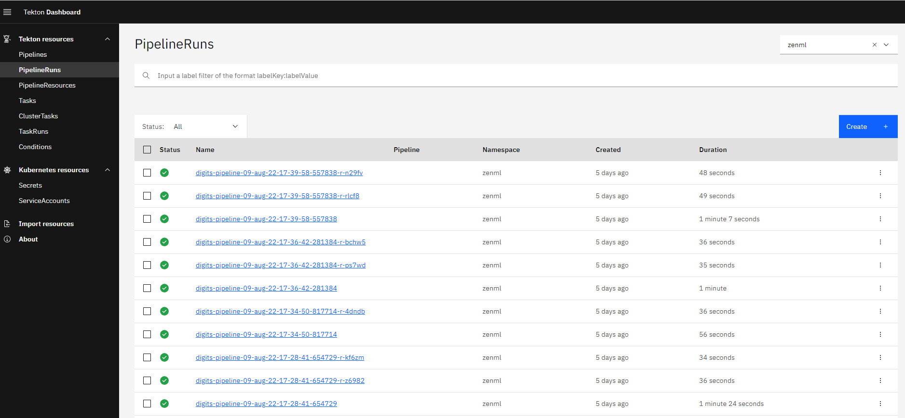
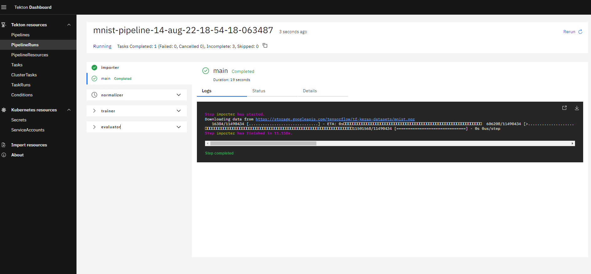

# 🏃 Run pipelines in production using Tekton Pipelines

When developing ML models, you probably develop your pipelines on your local
machine initially as this allows for quicker iteration and debugging. However,
at a certain point when you are finished with its design, you might want to 
transition to a more production-ready setting and deploy the pipeline to a more
robust environment.

[Tekton](https://tekton.dev/) is a powerful and flexible open-source framework for 
creating CI/CD systems, allowing developers to build, test, and deploy across cloud 
providers and on-premise systems. This examples shows you how easy it is to deploy 
ZenML pipelines on Tekton.

# 🖥 Run it

## 📄 Prerequisites

In order to run this example, we have to install a few tools that allow ZenML to
spin up a Tekton Pipelines setup:

* The Kubernetes command-line tool [Kubectl](https://kubernetes.io/docs/tasks/tools/#kubectl)
to deploy Tekton Pipelines
* [Docker](https://docs.docker.com/get-docker/) to build docker images that run
your pipeline in Kubernetes pods 

Next, we will install ZenML, get the code for this example and initialize a
ZenML repository:

```bash
# Install python dependencies
pip install zenml

# Install ZenML integrations
zenml integration install tekton tensorflow

# Pull the tekton example
zenml example pull tekton_pipelines_orchestration
cd zenml_examples/tekton_pipelines_orchestration

# Initialize a ZenML repository
zenml init

# Start the ZenServer to enable dashboard access
zenml up
```

## 🏃 Run the pipeline **without** tekton pipelines

We can now run the pipeline by simply executing the python script:

```bash
python run.py
```

The script will run the pipeline locally.

Re-running the example with different hyperparameter values will re-train
the model.

```shell
python run.py --lr=0.02
python run.py --epochs=10
```

## 🏃️ Run the same pipeline on a cloud-based Tekton Pipelines deployment

### 📄 Infrastructure Requirements (Pre-requisites)

Now with all the installation and initialization out of the way, all that's left
to do is configuring our ZenML [stack](https://docs.zenml.io/getting-started/core-concepts). For
this example, we will use GCP, but any other cloud provider of choice can  be used instead. We require the following infrastructure set up:

* An existing [GCP container registry](https://cloud.google.com/container-registry/docs).
* An existing [GCP bucket](https://cloud.google.com/storage/docs/creating-buckets).
* A [Cloud SQL MySQL](https://cloud.google.com/sql) database deployed in the same region as the Kubernetes cluster below.
* [Tekton Pipelines](https://tekton.dev/docs/pipelines/install/#installing-tekton-pipelines-on-kubernetes) deployed to a Google 
Kubernetes Engine cluster.
* The local docker client has to be [authorized](https://cloud.google.com/container-registry/docs/advanced-authentication) 
to access the GCP container registry.
* Kubectl can [access](https://cloud.google.com/kubernetes-engine/docs/how-to/cluster-access-for-kubectl) your GCP 
Kubernetes cluster.


### 🥞 Create a Tekton Pipelines Stack

To run our pipeline on Tekton Pipelines deployed to GCP, we will create a new stack with these components:
* The **artifact store** stores step outputs in a GCP Bucket. 
* The **metadata store** stores metadata inside Cloud SQL backed MySQL database.
* The docker images that are created to run your pipeline are stored in GCP **container registry**.
* The **Tekton orchestrator** is responsible for running your ZenML pipeline in Tekton Pipelines. 
  We need to configure it with the right kubernetes context so ZenML can run pipelines in your GCP cluster. 

When running the upcoming commands, make sure to replace `<PATH_TO_YOUR_CONTAINER_REGISTRY>` and 
`<PATH_TO_YOUR_GCP_BUCKET>` with the actual URIs of your container registry and bucket. You will also need to replace
`<NAME_OF_GCP_KUBERNETES_CONTEXT>` with the kubernetes context pointing to your gcp cluster.

Finally, you would have to replace the MySQL parameters in the metadata store command. In this example, we have show-cased the insecure way to do it, but you might want to do it via [secrets](https://docs.zenml.io/component-gallery/secrets-managers).

See [here](https://docs.zenml.io/mlops-stacks/metadata-stores/mysql) for more information about setting up a MySQL metadata store on the cloud.

```bash
# In order to create the GCP artifact store, we need to install one additional ZenML integration:
zenml integration install gcp

# Create and activate the stack and its components
zenml container-registry register gcr_registry --flavor=gcp --uri=<PATH_TO_YOUR_CONTAINER_REGISTRY>

zenml artifact-store register gcp_artifact_store --flavor=gcp --path=<PATH_TO_YOUR_GCP_BUCKET>

zenml orchestrator register gcp_tekton_orchestrator --flavor=tekton --kubernetes_context=<NAME_OF_GCP_KUBERNETES_CONTEXT>

zenml stack register gcp_tekton_stack \
    -a gcp_artifact_store \
    -o gcp_tekton_orchestrator \
    -c gcr_registry \
    --set

# Forward the Tekton pipelines UI and metadata store so we can access them locally
zenml stack up
```

### 🏁 See the Tekton Pipelines UI locally

ZenML takes care of forwarding the right ports locally to see the UI. All we need to do is run:

```bash
zenml stack up
```

When the setup is finished, you should see a local URL which you can access in
your browser and take a look at the Tekton Pipelines UI (usually at http://localhost:8080)



### ▶️ Run the pipeline

Configuring and activating the new stack is all that's necessary to switch from running your pipelines locally 
to running them on GCP:

```bash
python run.py
```



That's it! If everything went as planned this pipeline should now be running in the cloud, and we are one step 
closer to a production pipeline!


### 💻 Specifying per-step resources

If you're using the Tekton orchestrator and some of your pipelines steps have certain
hardware requirements, you can specify them using the step decorator as follows:

```python
from zenml.steps import step, ResourceConfiguration

@step(resource_configuration=ResourceConfiguration(cpu_count=8, memory="16GB"))
def my_step(...) -> ...:
    ...
```

This will make sure that your step runs on a machine with the specified resources as long
as such a machine is available in the Kubernetes cluster you're using.

### 🧽 Clean up

Once you're done experimenting, you can stop the port forwarding and delete the example files by calling:

```bash
zenml stack down --force
rm -rf zenml_examples
```

# 📜 Learn more

Our docs regarding the Tekton orchestrator integration can be found [here](https://docs.zenml.io/component-gallery/orchestrators/tekton).

If you want to learn more about orchestrators in general or about how to build your own orchestrators in ZenML
check out our [docs](https://docs.zenml.io/component-gallery/orchestrators/custom).
